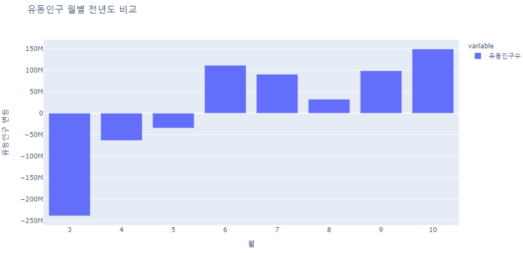
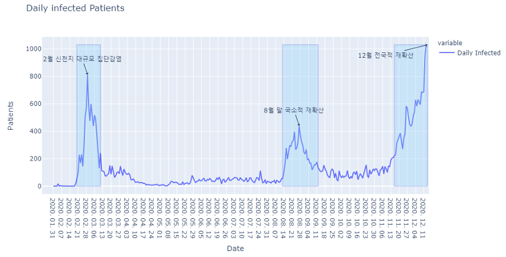
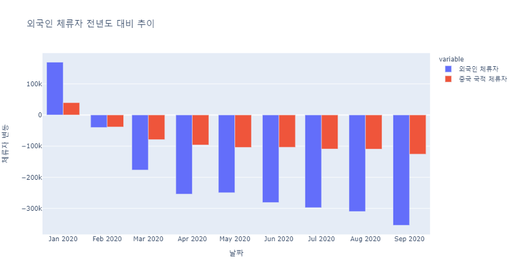
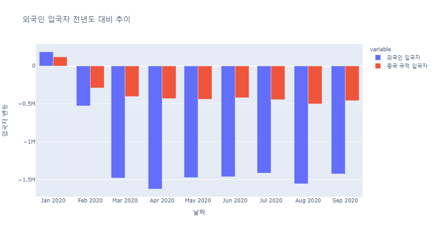
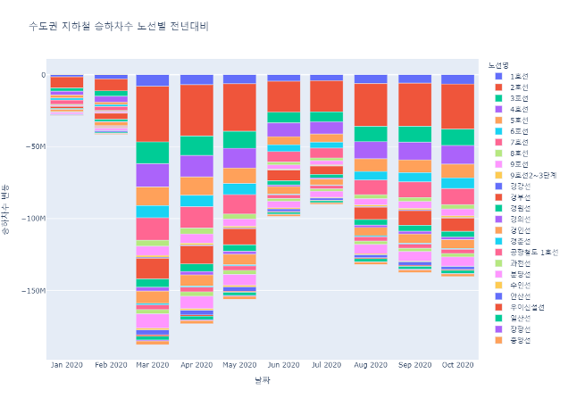
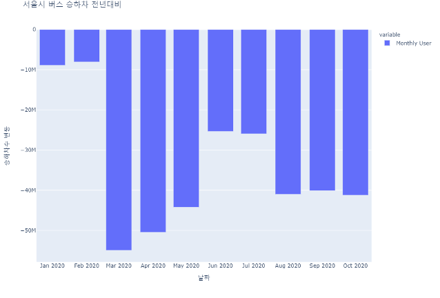
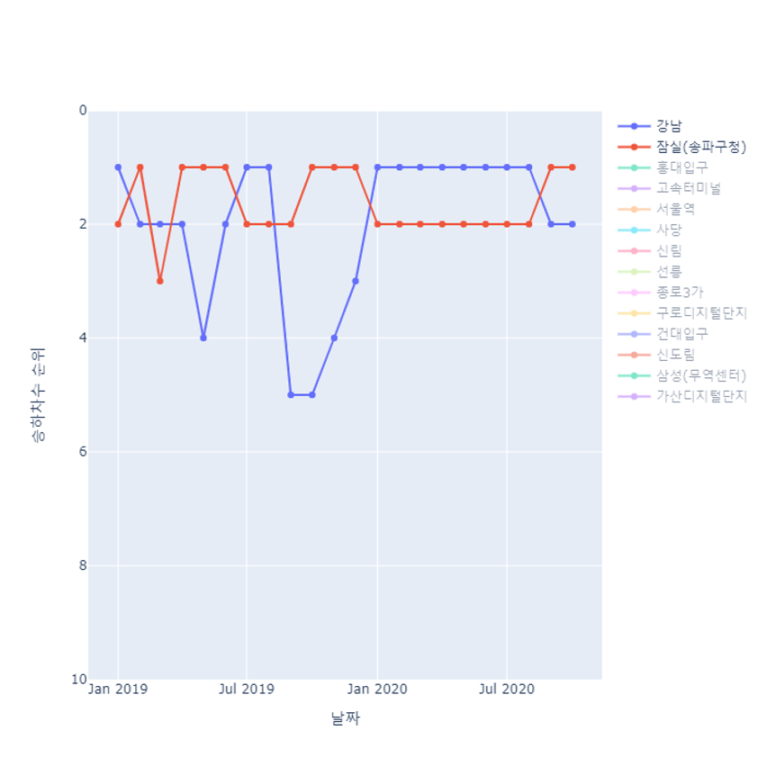
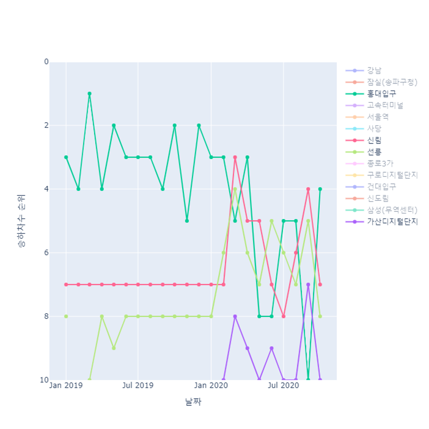

# 코로나 이후의 사회

## 주제 설명
+ 코로나-19로 사회적 거리두기 정책이 진행되고 있는 현재는, 모두가 경험한 적 없는 사회라고 해도 과장이 아닐 것입니다.
+ 이런 사회 변화를 어렴풋이 느낌으로만 알고 있었는데 수치로 표현할 수 없을까?
+ 공개 데이터셋을 활용, 코로나-19 대유행 전후의 사회적 변화를 수치화 하는것을 목표로 함 
---
## 사용된 데이터셋
+ 전국 통화유형, 서울 유동인구 데이터
  + SKTelecom 제공, 월별 갱신
+ 외국인 출입국, 체류자 데이터
  + 법무부 제공, 월별 갱신
+ 외국인 유동인구 데이터
  + 서울시 제공, 월별 갱신
+ 서울시 지하철, 버스 승하차 데이터
  + 서울시 제공, 월별 갱신
+ 정국 시도 및 서울시 구 geojson 데이터
  + 행안부 제공, github 변환, 2018년 기준

---

## 데이터셋 별 Plot 실험

다양한 Plot을 해보며 유의미한 결과를 찾아나갔다.

+ 확진자 수
  + 일일 확진자-날짜 plot
+ 유동 인구
  + 구별 Map plot
  + 요일 평균 plot
  + 월별 전년도 비교 plot
  + 월별, 연령별 전년도 비교 plot
+ 통화 발신 수
  + 시도별 가장 많이 발신된 통화유형 map plot
+ 외국인 유동인구 수
  + 요일 평균 plot
+ 외국인 입국 체류 수
  + 외국인 입국자 전년도 대비 추이
  + 외국인 입국자 전월 대비 변동
  + 외국인 체류자 전년도 대비 추이
  + 외국인 체류자 전월 대비 변동
+ 서울시 지하철 승하차
  + 노선별 승하차 추이
  + 승하차수 노선 별 전년대비
  + 승하차 상위 10개역 순위 추이
+ 서울시 버스 승하차
  + 승하차수 전년대비
  승하차수 상위 10개노선 전년대비

---
## 분석결과 도출
### 유동인구 지역별 MapPlot
[vid]

+ 주말에는 유동인구가 전체적으로 감소
+ 강남은 오후에 유동인구가 가장 높게 증가
+ 중구/종로구는 야간에 유동인구가 크게 감소
+ 6월 1일(토), 6월 2일(일), 6월 6일(현충일)

### 유동인구 월별 전년도 비교

+ 3월에 크게 감소, 이후로 감소세 하락
+ 이후 6월부터는 작년대비 소폭 증가

+ 8월 국지적 유행이 증가량 감소
+ 계속해서 유동인구 수 증가세 지속

### 시도별 가장 많이 건 통화유형 MapPlot
[vid]
+ 평시에는 금융기관 전화가 대부분
+ 코로나-19 유행 이후 쇼핑의 폭발적 증가
  + 2020년 2 ~ 5월
+ 이후 평시 회복하다가 의료기관 폭발적 증가
  + 2020년 9 ~ 10월
  + 독감 접종 및 2차 대유행(8월 말 ~) 의심

### 외국인 체류자 및 입국자 전년도 대비 추이

+ 1 ~ 2월 경 폭발적 감소
+ 이후 비슷하게 유지
+ 7월경에는 전월대비 입국자가 소폭 증가

### 수도권 지하철 및 버스 승하차 전년대비 Plot

+ 1월 ~ 2월경 소폭 감소, 3월 대폭 감소
  + 개학 지연, 비대면 수업, 재택근무 시행 
+ 4월 1일 이후 지하철 심야운행 축소
  + 승하차수에 큰 영향을 주지 않았음

### 서울 지하철 승하차 상위역 순위 추이

+ 평시 나들이철(3 ~ 5, 8 ~ 11) 잠실역이 항상 1위
+ 2020년 봄에는 강남역이 상시 1위
  + 롯데월드의 수요 급감으로 인한 순위 조정
  + [롯데월드 입장객 75% 감소 통계](https://www.sedaily.com/NewsVIew/1Z90XMJKWL)

  
+ 유흥수요가 대부분인 홍대입구역의 순위 하락
+ 출퇴근 역 위주의 순위 상승
  + 신림, 선릉, 가산디지털단지, 구로디지털단지

---

## 결론
+ 전체적인 유동인구 감소
+ 전체적인 출입국, 체류 외국인 감소
+ 비대면(통화 등) 쇼핑 증가
+ 유흥 등의 부수적 이동 비중 감소, 필수적 이동 비중 증가

+ 사회적 거리두기 시행 초기 유동인구 감소 성공
+ 이후 피로도로 유동인구 재 증가, 대중교통 이용량 증가
  + 국지적 감염 클러스터 발생
+ 9, 10월 유동인구 재 증가 -> 현재 폭발적 확진자 증가 중

---

## 참고문헌
1. [Plotly Docs](https://plotly.com/python/reference/index/)
2. [MapBox Docs](https://docs.mapbox.com)
3. [Pandas Docs](https://pandas.pydata.org/docs/reference/index.html)
4. [공공 데이터 포털](https://www.data.go.kr)
5. [SKT 데이터 허브](https://www.bigdatahub.co.kr/index.do)
6. https://stackoverflow.com/questions/53327572/how-do-i-highlight-an-entire-trace-upon-hover-in-plotly-for-python
7. https://github.com/southkorea/southkorea-maps/
